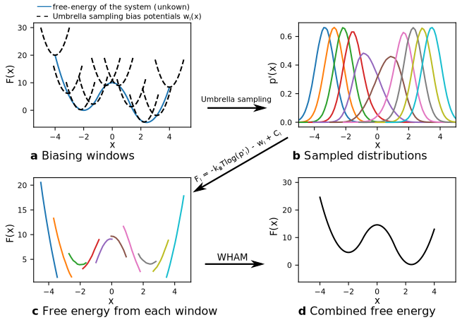

# Theory to accompany Exercise 2 - Umbrella Sampling

## Theory
This section explains more of the details behind umbrella sampling. Refer to [[1](#References), [2](#References)] for full information. The text in this section is from [[3](#References)].
 
The free energy of a system in the canonical ensemble is
 
$F=-k_B T \text{log}(Z),$
 
where $Z$ is the canonical partition function. For all but the smallest systems $Z$ is computationally intractable to calculate. However, often the most interesting information about a molecular system is given by the differences in the free energy across system states. A Collective Variable (CV; also called a reaction coordinate) can be defined which is a continuous variable that distinguishes different states. The simplest types of CVs are geometric distances (e.g. the distance between two molecules) but there are many other possibilities. The CV $x$ is a function of the atomic coordinates, $x(r)$, and multiple different realizations of $r$ can map to the same $x$. The probability distribution of the system can be written in terms of $x$:
 
$p(x) \propto \int{ e^{-\beta E(r)} \delta (x-x(r))dr},$
 
where we have integrated the Boltzmann distribution over all degrees of freedom for each value of $x$. The probability can be turned into a free energy:
 
$F(x) = -k_B T \text{log} (p(x)) + C,$
 
where $C$ is a constant and unimportant as we are only interested in $∆F$. In theory, the free energy profile along $x$ could be computed by sampling the system in equilibrium and recording the probability histogram of the values of $x$ which occur. However, for any non-trivial potential energy surface it will take a very long time to achieve sufficient sampling to get an adequately converged histogram — the high energy states will not be sampled.
 
To enhance the sampling umbrella sampling can be used. This adds additional biasing potentials $w(x)$ to the system to restrain it at certain values of $x$. The form of $w$ is usually a harmonic term:
 
$w(x) = \frac{1}{2} k (x-x_0)^2,$
 
where $k$ is a constant with units of energy per units of $x$ squared. We then run multiple simulations, each restrained with a different $w$, and then combine them to generate a probability distribution that sufficiently samples the whole range of $x$. The process is illustrated in figure 1 and explained in more detail as follows.

**Figure 1. Umbrella sampling method to compute a free energy profile.** (a) Multiple biasing potentials are placed across the collective variable $x$. The blue curve is the free energy of the system which we are trying to calculate. (b) Simulations are run for each window $w$. The resulting biased probability distributions $P'(x)$ are plotted. (c) The unbiased free energies $F_i$ from each window. They are each offset by a different $C_i$. (d) The Weighted Histogram Analysis Method (WHAM) is used to combine the windows and compute the free energy curve.

With a biasing potential $w(x(r))$ the potential energy of the system becomes
 
$E'(r) = E(r) + w((x(r)))$
 
which leads to a probability distribution (in the canonical ensemble) of
 
$p'(x) \propto \int e^{-\beta (E + w)} \delta (x - x(r)) dr \propto p(x) e^{-\beta w(x)},$
 
and a free energy of
 
$F'(x) = -k_B T \text{log}(p(x)) + w(x) + C = F(x) + w(x) + C.$
 
Thus, the unbiased free energy $F$ can be obtained by subtracting the biasing potential $w$ from the biased free energy $F'$. However, when more than one biasing window is used the value of $C$ cannot be neglected as it will be different for each window. For multiple biasing windows we have a set of unbiased (but offset by different $C_i$) free energies,
 
$F_i(x) = -k_B T \text{log}(p'_i) + w_i + C_i.$
 
To compute $F$ over the full range of $x$ the different $F_i(x)$ need to be combined. This can be accomplished by the Weighted Histogram Analysis Method (WHAM) [[1](#References)]. The WHAM equations are shown below. The free energy profile is also called the Potential of Mean Force (PMF); in this example we will assume they are equivalent and use them interchangeably.

## WHAM equations
The WHAM equations [1] are:
 
$P(x_j) = \frac{\sum^{N_w}_i h_i(x_j)}{\sum^{N_w}_i n_i e^ {\beta(C_i - w_i(x_j))} },$
 
$C_i = -k_B T \log\left( \sum_j P(x_j) e^{-\beta w_i(x_j)} \right).$
 
Where they have been written in a fully discretized form. $P(x_j)$ is the resulting unbiased probability distribution where $j$ is the index for the discrete set of $x_j$ that $P$ is computed over. $N_w$ is the number of windows, $i$ is the index of each window, $n_i$ is the number of data points (realizations of $x$) in the $i$-th window trajectory, $h_i(x_j)$ is the number of points in histogram bin $j$ from trajectory $i$, and  $w_i$ are the biasing potentials. Both equations depend on each other so must be solved self-consistently. In practice this is solved iteratively: initial guesses of $C_i$ are chosen, $P$ is then calculated using the first equation, new values of $C_i$ are then calculated using the second equation, and the process is iterated until the differences between successive values are sufficiently small.

## References

[1] Kumar, S., Rosenberg, J.M., Bouzida, D., Swendsen, R.H. and Kollman, P.A. (1992), *The weighted histogram analysis method for free-energy calculations on biomolecules. I. The method.* J. Comput. Chem., 13: 1011-1021. https://doi.org/10.1002/jcc.540130812  
[2] Kästner, J. (2011), *Umbrella sampling.* WIREs Comput Mol Sci, 1: 932-942. https://doi.org/10.1002/wcms.66  
[3] Farr, S. (2021), https://doi.org/10.17863/CAM.72078  
[4] Park, S., Khalili-Araghi, F., Tajkhorshid, E., and Schulten, K. (2003), *Free energy calculation from steered molecular dynamics simulations using Jarzynski’s equality.* J. Chem. Phys., 119 (6): 3559–3566. https://doi.org/10.1063/1.1590311  
